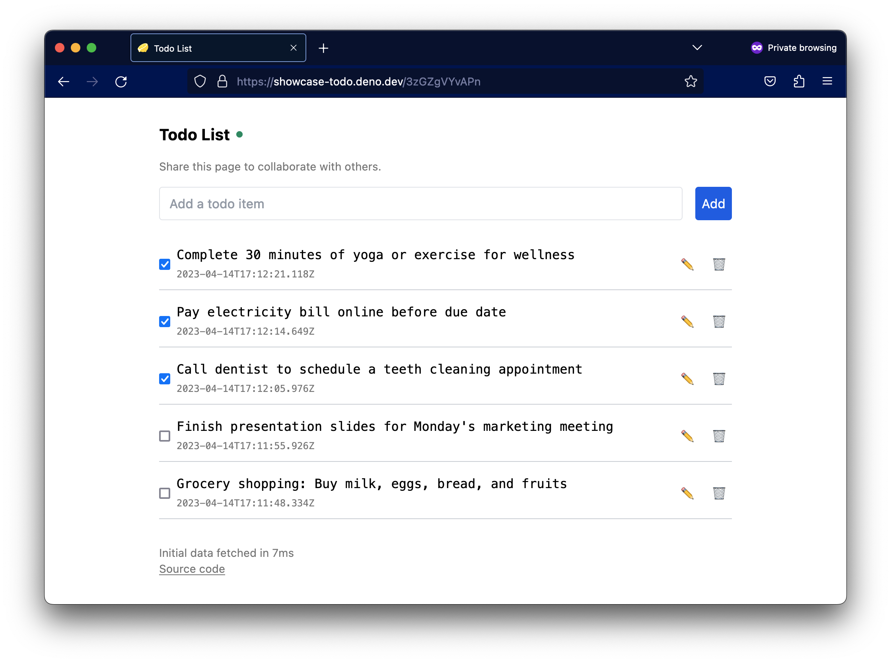

# `showcase_todo`



Collaborative todo-list app built with Deno and Fresh.

## Features

- Global persistent data and real-time collaboration using Deno KV
- Sends updates from server to clients using EventSource (server-sent events)

This project is hosted on Deno Deploy:

- Served from 35 edge locations around the world
- Scales automatically
- Data is a globally distributed Deno KV store with no setup required
- Code is deployed automatically when pushed to GitHub
- Automatic HTTPS (even for custom domains)
- Free for most hobby use cases

## Running locally

To run the app locally, you will need to install Deno. Then run from the root of
this repository:

```
deno task start
```
